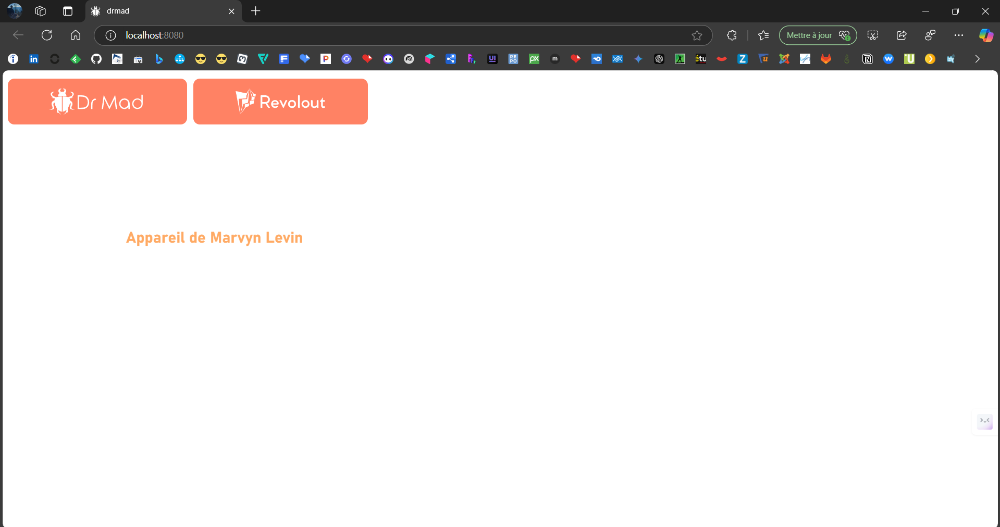
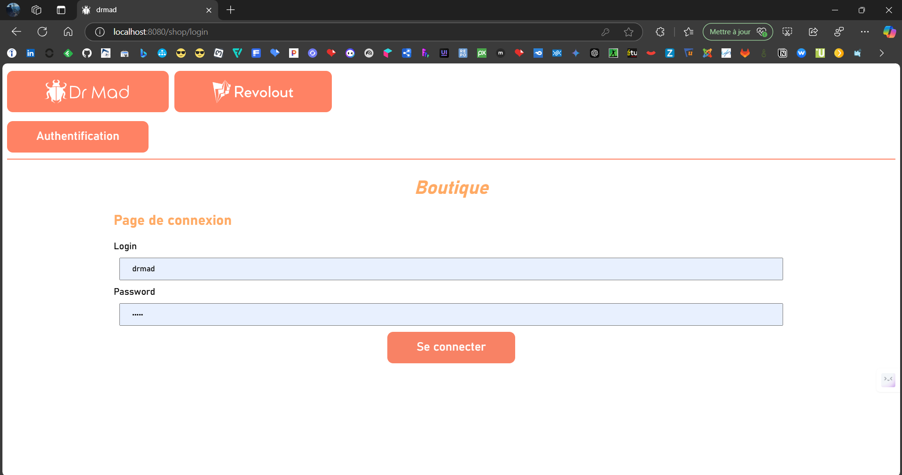
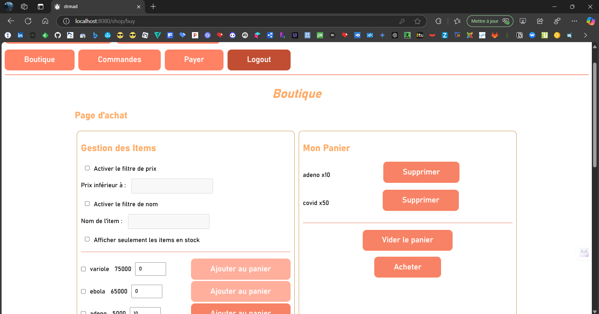
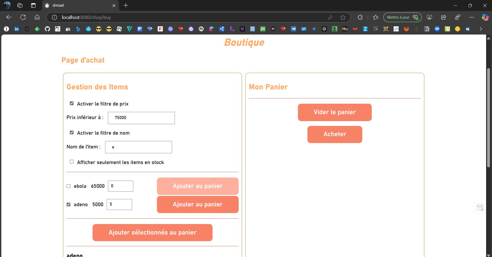
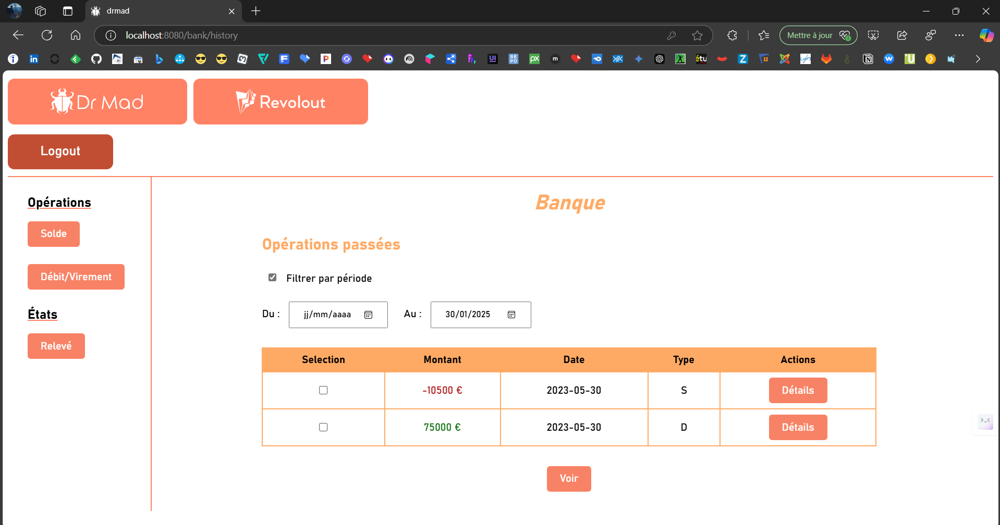
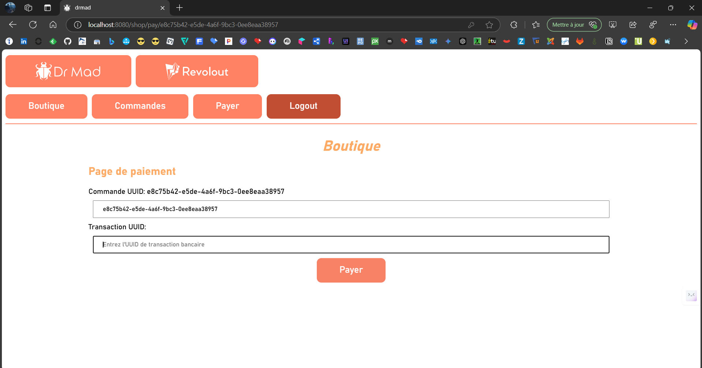
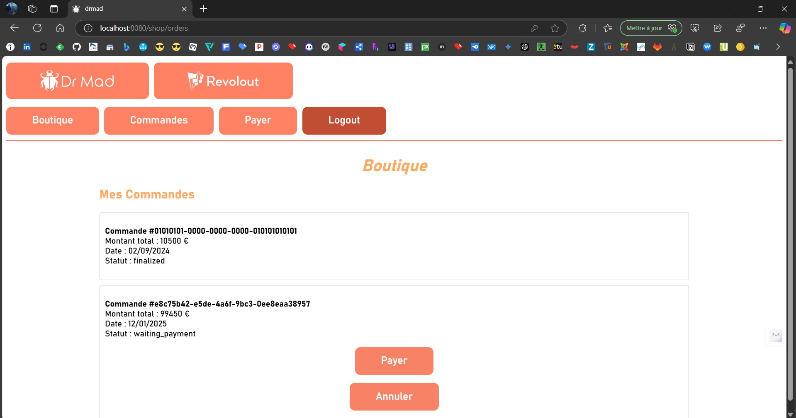
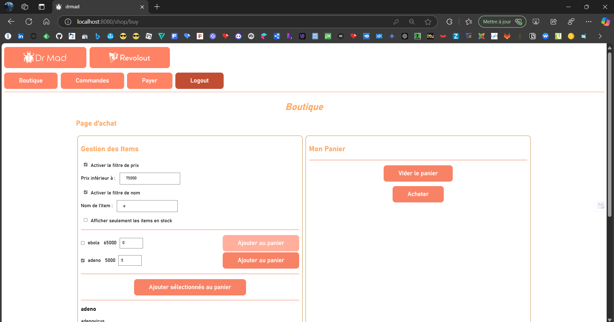
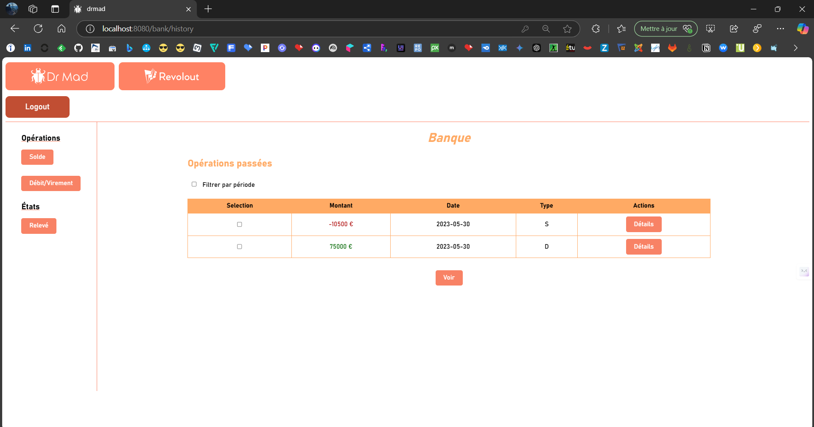
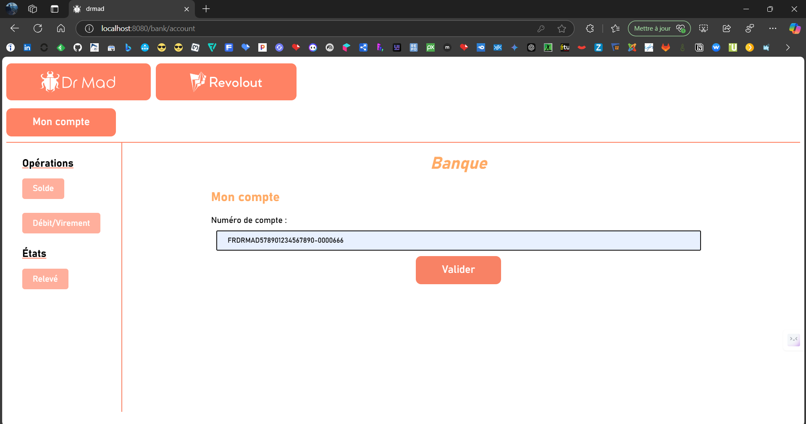

# Marvyn LEVIN - Projet BUT Informatique DrMad - 08/02/2024 07/05/2024


## Information Équipe

- **Membre** :
    - Marvyn LEVIN (référent)

- **Objectif** :  Développer DrMad et Revolout, une plateforme de gestion de virus et une banque en ligne permettant aux clients de parcourir, filtrer
  et acheter des produits en ligne tout en gérant efficacement les commandes et leur argent.

## Documents liés au projet

- [TP1 drmad-md](./docs/TP1_drmad.md) & [TP1 drmad-pdf](./docs/TP1_drmad.pdf)
- [TP2 drmad-md](./docs/TP2_drmad.md) & [TP2 drmad-pdf](./docs/TP2_drmad.pdf)
- [TP3 drmad-md](./docs/TP3_drmad.md) & [TP3 drmad-pdf](./docs/TP3_drmad.pdf)
- [TP4 drmad-md](./docs/TP4_drmad.md) & [TP4 drmad-pdf](./docs/TP4_drmad.pdf)
- [TP5 drmad-md](./docs/TP5_drmad.md) & [TP5 drmad-pdf](./docs/TP5_drmad.pdf)

## Cahier des Charges

### 1. Présentation du Projet

- **But** : Créer une plateforme en ligne attractive et illégale pour DrMad, spécialisée dans la vente de
  virus.

- **Moyens** : Développement en VueJs et prochainement avec MariaDB/PostGreSQL et Sequelize/Prisma.

- **Objectifs de l'application** :
    - **Page accueil** : Permet d'accéder aux 2 applications sur la page d'accueil.
    - **DrMad** : Représente la boutique avec le login, la page de la boutique, la page des commandes, de paye et, etc.
    - **Revolout** : Représente la banque avec un login, une page de solde, de relevé de compte et de virement,débit.

### 2. Types de Fichiers

- **Modèle Vue (.Vue)** : Réalisé avec [VueJs](https://fr.vuejs.org/) et disponible au format `.vue`.

### 3. Recherche Documentaire

- **Ressources** :
    - Aucune ressources sur ce projet

### 4. Répartition du Travail

- **Marvyn LEVIN** :
    - tp1, tp2, tp3, tp4, tp5

## Concept de Modélisation

### Inspiration et Conception Visuelle et Technique

L'interface utilisateur de l'application **DrMad** permet aux utilisateurs de naviguer à travers les fonctionnalités
bancaires et la boutique en ligne de manière fluide et agréable. Voici les points clés :

1. **Navigation principale** : En haut de l'interface, une barre de navigation permet aux utilisateurs de basculer
   facilement entre la **boutique** et la **banque**. Selon le contexte, les options de la barre peuvent se modifier,
   par exemple en ajoutant des options telles que "Login", "Déconnexion", "Mes commandes" ou "Mon compte".



2. **Authentification et comptes** : Lorsqu'un utilisateur se connecte, le texte de la barre de navigation évolue,
   indiquant un état authentifié (comme "Logout"), et de nouvelles fonctionnalités deviennent accessibles, comme la
   possibilité d’acheter des produits ou de consulter l’historique de ses commandes.



3. **Gestion des achats** : Dans la boutique, les produits sont présentés sous forme de listes avec des options de
   quantités et d'ajout au panier. Les utilisateurs peuvent facilement sélectionner plusieurs produits et voir un
   récapitulatif dans leur panier, qui affiche aussi le montant total de leur commande, y compris les promotions.



4. **Filtrage des articles** : L'application offre un système de filtrage et de tri des produits en fonction de
   critères comme le prix ou la disponibilité. En mode bancaire, l'utilisateur peut filtrer ses transactions par date
   pour consulter son relevé.



5. **Historique et Suivi des Transactions** : Le suivi des commandes et des transactions bancaires est un point central
   de l’application. Les utilisateurs peuvent consulter l'historique des commandes, payer des commandes en attente ou
   annuler des transactions.



6. **Interactions Utilisateur** : Les utilisateurs peuvent interagir avec différents éléments, comme valider un paiement
   via un UUID de transaction bancaire, et valider des virements ou des achats. Un retour visuel et des messages
   d'erreur sont affichés en cas de transaction invalide.




7. **Esthétique et Organisation** : L'interface est conçue pour offrir une expérience fluide et claire, avec une
   disposition logique des éléments. Chaque section est bien délimitée, que ce soit pour l’aspect bancaire ou la
   boutique, et chaque action est clairement identifiable par des boutons et des interactions directes.




## Instructions d'Exécution sur Windows

### Étapes d'Installation

1. **Installation de VueJs :**  
   Téléchargez et installez VueJs depuis le site officiel : [VueJs Guide](https://fr.vuejs.org/guide/quick-start.html).

### Lancement de l'App Vue

### App lancée

Lorsque l'app Vue est lancée, vous devriez voir le message suivant :

```shell
  App running at:
  - Local:   http://localhost:8080/ 
  - Network: http://172.26.43.13:8080/
```

Pour vous connecter à la boutque, il faut taper `drmad`, en `identifiant` et la même chose en `mot de passe` :


Et pour vous connecter à la banque, il faut taper `FRDRMAD578901234567890-0000666` :



